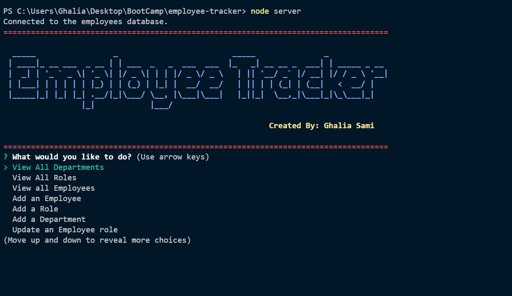

# Employee-tracker

## Purpose:
Tracking employee's database.

## Description:
GIVEN a command-line application that accepts user input
WHEN the user starts the application
THEN the app will display  the following options: view all departments, view all roles, view all employees, add a department, add a role, add an employee, and update an employee role
WHEN the user choose to view all departments
THEN the app will display  a formatted table showing department names and department ids
WHEN the user choose to view all roles
THEN the app will display the job title, role id, the department that role belongs to, and the salary for that role
WHEN the user choose to view all employees
THEN the app will display a formatted table showing employee data, including employee ids, first names, last names, job titles, departments, salaries, and managers that the employees report to
WHEN the user choose to add a department
THEN the app will ask the user to enter the name of the department and that department is added to the database
WHEN the user choose to add a role
THEN the app will ask the user to enter the name, salary, and department for the role and that role is added to the database
WHEN the user choose to add an employee
The app will ask to enter the employee’s first name, last name, role, and manager and that employee is added to the database
WHEN the user choose to update an employee role
the app will ask to select an employee to update and their new role and this information is updated in the database 

## instructions : 
* Install the npm package , then enter 'node server' OR
* visit the walk throw video (https://youtu.be/dI9h_WXMxbE)

## Usage:
After installing npm and running the app, the app will look like the following snip:

### Contribution:
Made with ❤️️ by Ghalia Sami. 
For more information, Please contact me.
Email: ghaliarose89@gmail.com

### ©️ [2021] [Ghalia Sami]